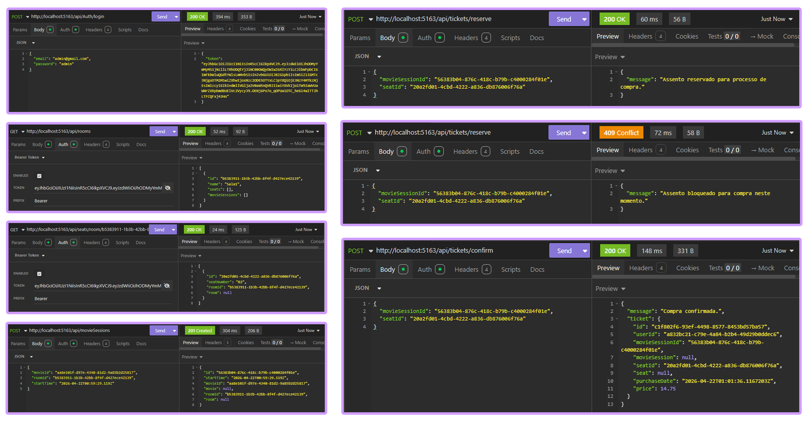
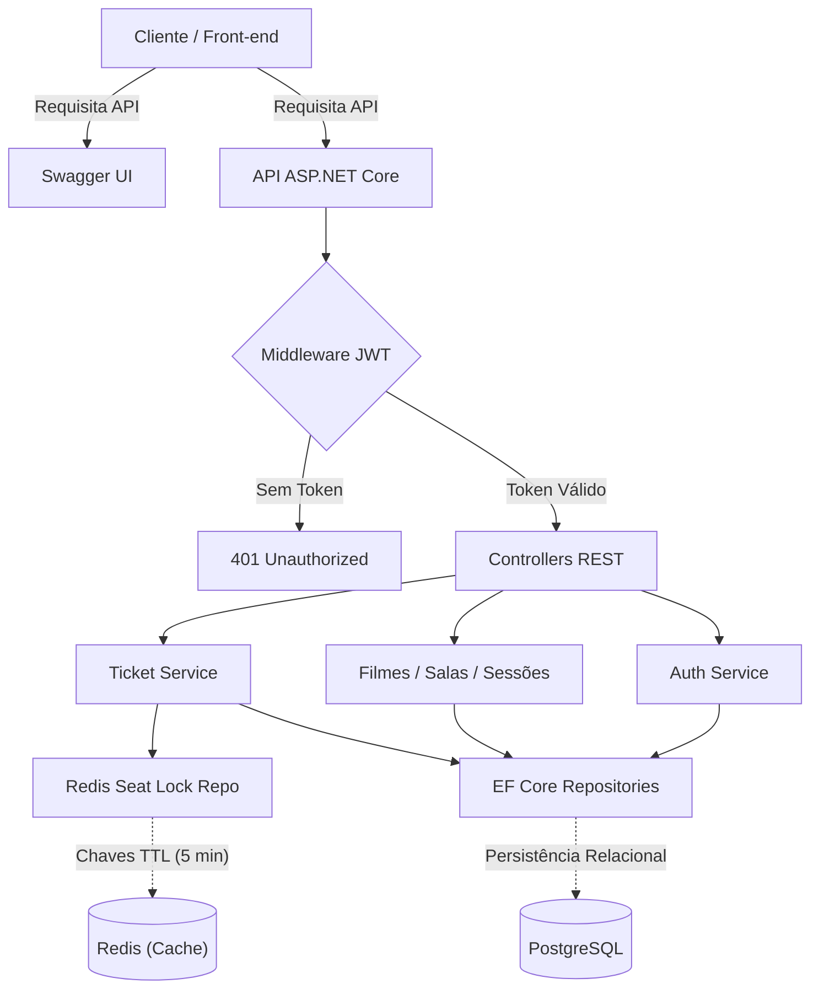
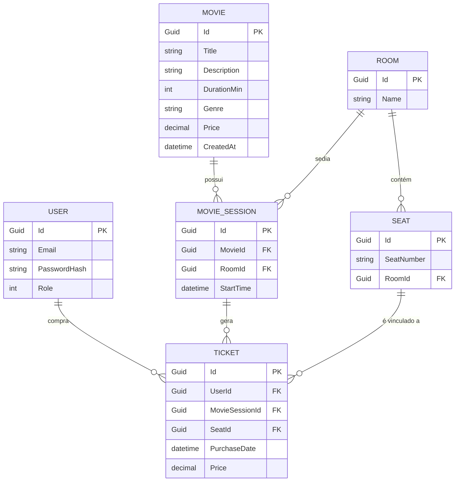

# Movie Ticketing API


Uma API RESTful completa desenvolvida para o gerenciamento e venda de ingressos de cinema, buscando simular o fluxo real de um cinema.



<details>
<summary><strong>⭕ Detalhamento da stack</strong></summary><br/>

| Categoria          | Tecnologia / Padrão   | Motivação Principal                                     |
| :----------------- | :-------------------- | :------------------------------------------------------ |
| **Framework**      | ASP.NET Core (C#)     | Alta performance, tipagem forte e escalabilidade        |
| **Arquitetura**    | N-Tier (Multicamadas) | Separação de responsabilidades e fácil manutenção       |
| **ORM**            | Entity Framework Core | Gestão de migrations e proteção contra SQL Injection    |
| **Modelagem**      | DTOs (C# Records)     | Imutabilidade e proteção contra mass assignment         |
| **Design de API**  | RESTful               | Padronização via verbos e status codes HTTP             |
| **Banco de Dados** | PostgreSQL            | Integridade referencial (ACID) para transações seguras  |
| **Concorrência**   | Redis                 | Locks temporários de baixa latência com expiração (TTL) |
| **Segurança**      | JWT & BCrypt          | Autenticação stateless e criptografia de senhas         |
| **Infraestrutura** | Docker & Compose      | Ambiente isolado e idêntico para toda a stack           |

</details>

## 🔴 Funcionalidades

- [x] Sistema de autenticação com níveis de permissão (Role-Based Access Control), onde utilizadores comuns podem consultar filmes e sessões, enquanto administradores gerem o inventário;

- [x] CRUD completo do catálogo de filmes, salas e poltronas, utilizando DTOs para garantir que apenas os dados necessários trafeguem na rede;

- [x] Criação de sessões vinculando filmes a salas específicas com horários definidos, validando a disponibilidade física do local;

- [x] Sistema de trava (lock) de assentos que reserva a poltrona selecionada reservado por 5 minutos para o utilizador, impedindo que outra pessoa o compre simultaneamente;

- [x] Middleware global de tratamento de erros, interceptando exceções de domínio e erros silenciosos para padronizar as respostas da API no formato oficial da RFC 7807 (problem details);

- [x] Cobertura de testes unitários da camada de Services utilizando [xUnit](https://xunit.net/?tabs=cs) e [Moq](https://github.com/devlooped/moq), seguindo o padrão AAA (arrange, act, assert) para garantir a integridade das regras de negócio;

- [x] Documentação em interface interativa para testes de todos os endpoints via Swagger.

## 🟠 Arquitetura

O projeto segue a **Arquitetura em Camadas (N-Tier)** com intenção de priorizar o isolamento de responsabilidades entre exposição, regras de negócio e acesso aos dados (<mark>**&nbsp;Controllers → Services → Repositories&nbsp;**</mark>), facilitando a testagem, manutenção e aumentando a segurança.



- Controllers responsáveis pelo recebimento de requisições HTTP, validação da autenticação via JWT e retorno de status codes padronizados;

- Services responsáveis pelas regras de negócio e validação de domínio;

- Repositories responsáveis por isolar as consultas do Entity Framework Core e centralizar a comunicação com o PostgreSQL, utilizando métodos como `AsNoTracking()` e `ExecuteDeleteAsync()` para realizar leituras e exclusões de forma eficiente e performática;

- Data Transfer Objects responsáveis por garantir a imutabilidade dos dados em trânsito (utilizando tipos `record` do C#) e aplicar validações via data annotations para previnir vulnerabilidades de segurança (mass assignment/overposting);

- Controle de concorrência com locks time-to-live (TTL) via in-memory data store ([Redis](https://redis.io/)) para prevenção de race conditions (double-booking da mesma poltrona).

##

Abaixo, o Modelo Entidade-Relacionamento (MER) do schema do banco de dados, de forma a demonstrar os relacionamentos entre as entidades `User`, `Movie`, `Room`, `Seat`, `MovieSession` e `Ticket`:



- Espelhamento da hierarquia física de um cinema, onde um filme (Movie) e uma sala (Room) podem ter várias sessões (MovieSessions) e uma sala (Room) pode conter vários assentos (Seats);

- Entidade Ticket atuando como o ponto de convergência (tabela associativa), vinculando quem comprou (User), o evento específico (MovieSession) e o lugar exato (Seat);

- Campo Price presente tanto em Movie quanto em Ticket, garantindo a preservação histórica do preço caso haja uma alteração.

## 🟡 Endpoints

Todas as respostas da API seguem um formato JSON previsível para facilitar a integração pelo front-end.

> A documentação interativa e completa de todos os endpoints, incluindo os esquemas de requisição e resposta, está disponível via [Swagger UI](https://swagger.io/) ao rodar a aplicação (acessível em `/swagger`).

**Exemplo de Sucesso (200, 201):**

```json
{
  "id": "26bb58be-c9d1-448d-8953-7ca453eb352f",
  "title": "Divertidamente",
  "description": "Emoções malucas",
  "durationMin": 90,
  "genre": "Animação",
  "createdAt": "2026-04-20T19:36:35.827702Z",
  "price": 13.5
}
```

**Exemplos de Erro (400, 401, 403, 404, 405, 409):**

```json
{
  "type": "https://httpstatuses.io/401",
  "title": "Unauthorized",
  "status": 401,
  "detail": "Você não está autenticado. Forneça um token válido.",
  "instance": "/api/movies"
}
```

##

```
Legenda das tabelas:
[🌐] Público: não requer autenticação;
[🔒] Autenticado: requer envio do token no header (Authorization: Bearer <token>);
[👤] User: qualquer usuário logado no sistema;
[🛠️] Admin: acesso restrito a usuários com privilégios de administrador (role definido como Admin).
```

- ### Auth

| Método | Rota                 | Descrição                              | Status | Acesso |
| :----- | :------------------- | :------------------------------------- | :----- | :----- |
| POST   | `/api/auth/register` | Cadastra um novo usuário no sistema    | `200`  | 🌐     |
| POST   | `/api/auth/login`    | Autentica o usuário e gera o token JWT | `200`  | 🌐     |

- ### Movies

| Método | Rota              | Descrição                          | Status | Acesso |
| :----- | :---------------- | :--------------------------------- | :----- | :----- |
| GET    | `/api/movies`     | Lista todos os filmes              | `200`  | 🌐     |
| GET    | `/api/movies/:id` | Retorna os detalhes de um filme    | `200`  | 🌐     |
| POST   | `/api/movies`     | Cadastra um novo filme no catálogo | `201`  | 🛠️     |
| PUT    | `/api/movies/:id` | Atualiza as informações            | `200`  | 🛠️     |
| DELETE | `/api/movies/:id` | Remove um filme do catálogo        | `204`  | 🛠️     |

- ### Rooms

| Método | Rota             | Descrição                       | Status | Acesso |
| :----- | :--------------- | :------------------------------ | :----- | :----- |
| GET    | `/api/rooms`     | Lista todas as salas do cinema  | `200`  | 🔒     |
| GET    | `/api/rooms/:id` | Retorna os detalhes de uma sala | `200`  | 🔒     |
| POST   | `/api/rooms`     | Cadastra uma nova sala          | `201`  | 🛠️     |
| PUT    | `/api/rooms/:id` | Atualiza o nome da sala         | `200`  | 🛠️     |
| DELETE | `/api/rooms/:id` | Remove uma sala do sistema      | `204`  | 🛠️     |

- ### Seats

| Método | Rota                      | Descrição                                   | Status | Acesso |
| :----- | :------------------------ | :------------------------------------------ | :----- | :----- |
| GET    | `/api/seats/room/:roomId` | Lista todas as poltronas de uma sala        | `200`  | 🌐     |
| GET    | `/api/seats/:id`          | Retorna detalhes de uma poltrona específica | `200`  | 🌐     |
| POST   | `/api/seats`              | Cadastra uma nova poltrona vinculada a sala | `201`  | 🛠️     |
| PUT    | `/api/seats/:id`          | Atualiza a numeração de uma poltrona        | `200`  | 🛠️     |
| DELETE | `/api/seats/:id`          | Remove a poltrona do sistema                | `204`  | 🛠️     |

- ### MovieSessions

| Método | Rota                     | Descrição                                     | Status | Acesso |
| :----- | :----------------------- | :-------------------------------------------- | :----- | :----- |
| GET    | `/api/moviesessions`     | Lista todas as sessões agendadas              | `200`  | 🌐     |
| GET    | `/api/moviesessions/:id` | Retorna detalhes de uma sessão específica     | `200`  | 🌐     |
| POST   | `/api/moviesessions`     | Cria uma sessão vinculando Filme, Sala e Hora | `201`  | 🛠️     |
| PUT    | `/api/moviesessions/:id` | Remarca horário ou altera a sala da sessão    | `200`  | 🛠️     |
| DELETE | `/api/moviesessions/:id` | Cancela uma sessão agendada                   | `204`  | 🛠️     |

- ### Tickets

| Método | Rota                   | Descrição                                      | Status | Acesso |
| :----- | :--------------------- | :--------------------------------------------- | :----- | :----- |
| POST   | `/api/tickets/reserve` | Aplica o distributed lock (Redis) na poltrona  | `200`  | 🔒     |
| POST   | `/api/tickets/confirm` | Efetiva a compra e gera o ingresso no Postgres | `200`  | 🔒     |

## 🟢 Execução

**Pré-requisitos:** [.NET SDK](https://dotnet.microsoft.com/download) e [Docker Desktop](https://www.docker.com/products/docker-desktop) instalados.

```bash
# Instale a ferramenta global do EF Core
dotnet tool install --global dotnet-ef

# Instale os pacotes necessários nos respectivos projetos
dotnet add src/MovieTicketingAPI/MovieTicketingAPI.csproj package Npgsql.EntityFrameworkCore.PostgreSQL
dotnet add src/MovieTicketingAPI/MovieTicketingAPI.csproj package EFCore.NamingConventions
dotnet add src/MovieTicketingAPI/MovieTicketingAPI.csproj package Microsoft.EntityFrameworkCore.Design
dotnet add src/MovieTicketingAPI/MovieTicketingAPI.csproj package Microsoft.EntityFrameworkCore.Tools
dotnet add src/MovieTicketingAPI/MovieTicketingAPI.csproj package Swashbuckle.AspNetCore
dotnet add src/MovieTicketingAPI/MovieTicketingAPI.csproj package BCrypt.Net-Next
dotnet add src/MovieTicketingAPI/MovieTicketingAPI.csproj package Microsoft.AspNetCore.Authentication.JwtBearer
dotnet add src/MovieTicketingAPI/MovieTicketingAPI.csproj package StackExchange.Redis
dotnet add tests/MovieTicketingAPI.Tests/MovieTicketingAPI.Tests.csproj package Moq

# Inicialize o gerenciador de variáveis de ambiente locais
cd src/MovieTicketingAPI
dotnet user-secrets init

## Configure a conexão com o PostgreSQL
dotnet user-secrets set "ConnectionStrings:DefaultConnection" "Host=localhost;Port=5432;Database=DB_NAME;Username=DB_USER;Password=DB_PASSWORD"

## Configure a conexão com o Redis
dotnet user-secrets set "ConnectionStrings:RedisConnection" "localhost:6379"

## Configure a chave do JWT (mínimo de 32 caracteres)
dotnet user-secrets set "JwtSettings:SecretKey" "InserirChaveAquiComNoMinimo32Caracteres"

# Configure as seguintes variáveis de ambiente baseadas no .env.example
# As credenciais devem ser idênticas às configuradas no User-Secrets
## DB_USER= usuário do banco de dados
## DB_PASSWORD= senha do banco de dados
## DB_NAME= nome do banco de dados

# Inicialize os contêineres do PostgreSQL e Redis na raiz do projeto
cd ../..
docker compose up -d

# Aplique as migrations do banco de dados (pelo )
dotnet ef database update --project src/MovieTicketingAPI/MovieTicketingAPI.csproj

# Inicie a aplicação
dotnet run --project src/MovieTicketingAPI/MovieTicketingAPI.csproj

# Execução de testes unitários
dotnet test
```

- **Observação:** Se a sua migration falhar ou o Docker não subir o PostgreSQL acusando que a porta já está em uso, é provável que você tenha uma instalação local do Postgres rodando. Para resolver, siga os passos abaixo e depois refaça a inicialização dos contêineres e das migrations.
  - No Windows, pressione `Win + R`, digite `services.msc`, procure por `postgresql` na lista, clique com o botão direito e selecione "Parar".

  - No Linux, abra o terminal e execute o comando `sudo systemctl stop postgresql`.

> A aplicação conta um seeder (`Persistence/DbSeeder.cs`) que gera dados mockados para todas as entidades. O usuário administrador inicial é identificado pelo email fictício <b>`admin@gmail.com`</b> com a senha <b>`admin`</b>.

## 🔵 Contato

<p align="left">
  Em caso de dúvidas ou comentários, entre em contato:&nbsp;
  
  <a href="https://www.linkedin.com/in/barbara-wehrmann/" title="LinkedIn">
    
  </a>
  <a href="mailto:barbarastellaw@gmail.com" title="Gmail">
    
  </a>
  <a href="https://www.instagram.com/barbarastellaw" title="Instagram">
    
  </a>
</p>
